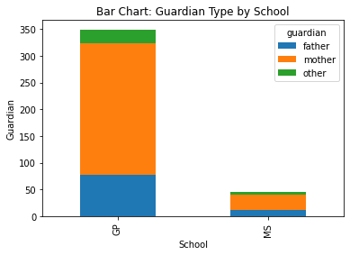
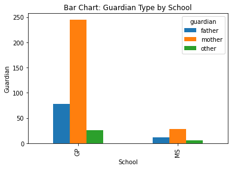
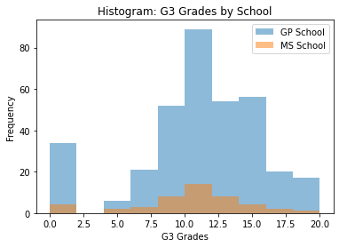
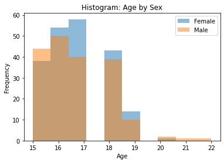
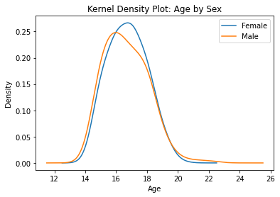
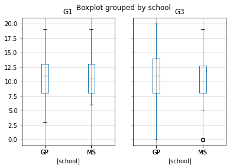
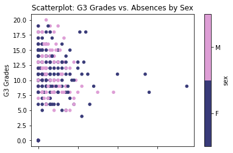
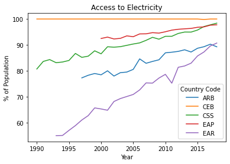

# Summarizing Data

Summarize Student Data and World Development Data from the UCI machine learning repository.

[Project report](https://htmlpreview.github.io/?https://raw.githubusercontent.com/chsueh2/Summarizing_Data/main/Summarizing_Data.html) 

Key features:

- Exploratory data analysis (EDA)
- One-way, Two-way and Three-way Contingency Tables
- Conditional Two-way Table
- Stacked Bar Graph and Side-by-Side Bar Graph
- Correlation matrix
- Histogram, Kernel Density Plot, Boxplot and Scatterplot
- Line Charts

Modules used:

- `numpy`: Python library used for working with arrays
- `pandas`: data manipulation and analysis. In particular, it offers data structures and operations for manipulating numerical tables and time series.
- `matplotlib.pyplot`: plotting library for creating static, animated, and interactive visualizations
- `itertools`: functions creating iterators for efficient looping

## Project Report

[Project report](https://htmlpreview.github.io/?https://raw.githubusercontent.com/chsueh2/Summarizing_Data/main/Summarizing_Data.html) ([Jupyter Notebook](./Summarizing_Data.ipynb))

The analysis results with theoretical backgrounds are included.

Chien-Lan Hsueh (chienlan.hsueh at gmail.com)

## Overview and Project Goal

Read in Student Data and World Development Data from the UCI machine learning repository using pandas and matplotlib. Convert the categorical variables into category type and create contingency tables (one-way, two-way and three-way). Also create a conditional two-way table by subsetting the data. Use various types of plots for data visualization.

## Workflow

1. Preparation and Load Modules
1. Student Data
   - Summarize categorical variables
   - Summarize numerical variables
1. World Development Data
   - summarize the data
   - How the access to clean fuels and technologies for cooking has changed over time in Arab world (ARB)?
   - How the access to electricity has changed over time in the following regions?
   - How the access to electricity has changed over time in rual and uraban areas in Arab world?
   

   

   

   

